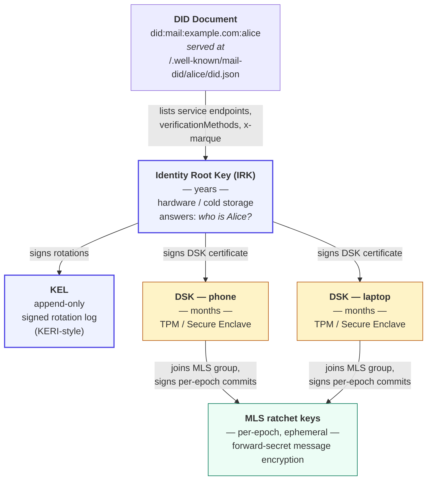
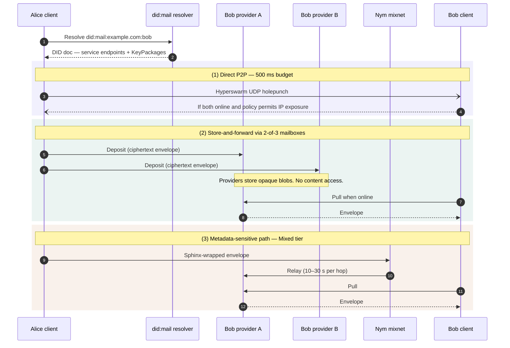
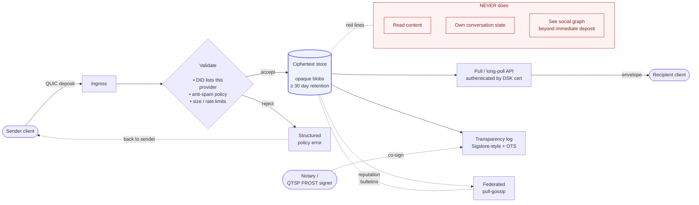
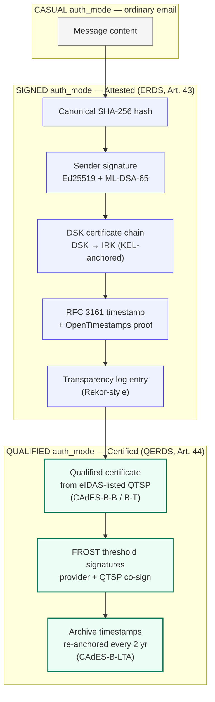
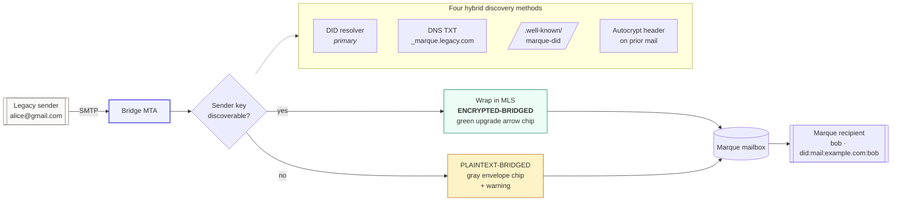

# Architecture overview

> Visual and prose walkthrough of the Marque system at two levels: the **identity stack** (who is Alice) and the **message path** (how a letter travels from Alice to Bob). Non-normative; for normative detail see [`spec/protocol/03-architecture.md`](../spec/protocol/03-architecture.md) and [`spec/protocol/05-cryptography.md`](../spec/protocol/05-cryptography.md).

---

## 1. The identity stack

A Marque identity is three layers of keys plus a DID document. The DID document is resolved via DNS by default; the keys are rotated and recoverable.



_Source: [`diagrams/identity-stack.mmd`](./diagrams/identity-stack.mmd)._

**Why three tiers:**

- The IRK is the answer to "who is Alice" — it is what her correspondents trust.
- The DSK is the answer to "which device is signing" — compromising a phone does not compromise the identity; the DSK cert is revoked by publishing a KEL rotation.
- The MLS ratchet keys are the answer to "which epoch is this message in" — they provide forward secrecy without being tied to long-term identity.

**Recovery:**

1. **Primary** — device-resident DSK.
2. **Social** — 3-of-5 guardians, 72-hour delay, primary-device notification.
3. **Optional** — 24-word phrase for power users.

---

## 2. The message path

Alice wants to send a message to Bob (who also has a `did:mail`). Three possible paths; the client picks the first that succeeds.



_Source: [`diagrams/message-path.mmd`](./diagrams/message-path.mmd)._

**The envelope.**

```
┌────────────────────────── CBOR envelope ──────────────────────────┐
│ recipient_pseudonym: HMAC(bob_key, epoch)                         │
│ sender_cert:         DSK cert chained to Alice's IRK              │
│ auth_mode:           CASUAL | SIGNED | QUALIFIED                  │
│ timestamp:           RFC 3161 + OpenTimestamps (Attested+)        │
│ ciphertext:                                                       │
│   ┌───────────── MLS AppMessage (encrypted) ─────────────┐       │
│   │ alt_plaintext:  "Bob, budget attached..."            │       │
│   │ locales:        ["en", "fr"]                         │       │
│   │ blocks:                                              │       │
│   │   - core.text:      "..."                            │       │
│   │   - core.attachment: BLAKE3 CID, source list         │       │
│   │   - core.schedule:   proposed slots                  │       │
│   └──────────────────────────────────────────────────────┘       │
│ pad_to:              4KB | 16KB | 64KB | 256KB | 1MB | 4MB       │
└───────────────────────────────────────────────────────────────────┘
```

**What the provider sees:**

| Metadata tier | Provider sees |
|---|---|
| Casual | Sender DID, recipient DID, timestamps. |
| **Sealed (default)** | Recipient pseudonym, delivery token, timestamps. |
| Mixed | Only the pseudonym; routing via Nym mix hops. |

---

## 3. The provider's job

A Marque provider is a **dumb encrypted mailbox**. It is NOT a conversation state machine.



_Source: [`diagrams/provider-role.mmd`](./diagrams/provider-role.mmd)._

**What this gives providers:**

- Storage scales as `Σ (envelopes × ciphertext_size)`. Not as `Σ (users × rooms × membership × history)`.
- Compliance, storage, AI inference, transactional APIs are their revenue streams (Part 9).
- Portable identity means they compete on service, not lock-in.

---

## 4. The legal-proof layer

For the Attested and Certified tiers, the envelope carries a `ProofEnvelope`:



_Source: [`diagrams/proof-envelope.mmd`](./diagrams/proof-envelope.mmd)._

This is the structure a court sees. The verifier:

1. Checks the sender signature against the DSK cert chain.
2. Verifies the TSA timestamp against a trusted trust list.
3. Verifies the FROST threshold — one QTSP-listed signer is required at Certified tier.
4. Verifies the OpenTimestamps proof against any Bitcoin full node.
5. Confirms the archive timestamp chain is unbroken to the present.

**No trusted third party is required** for step 4 — OpenTimestamps is verifiable against public Bitcoin state alone. This is the property RFC 3161 TSAs cannot provide.

---

## 5. The SMTP bridge

Bridges are tier-zero operations during the 10–20 year transition. Their job is to preserve reply continuity with `@gmail.com` and label honestly.



_Source: [`diagrams/smtp-bridge.mmd`](./diagrams/smtp-bridge.mmd)._

UX chips (full vocabulary in [`lexicon.md`](./lexicon.md)):

- *(no chip)* — native Marque message, `CASUAL` auth-mode.
- **Signed** (pen glyph) — native, `SIGNED` auth-mode (Attested tier, eIDAS ERDS).
- **Registered** (blue scales) — native, `QUALIFIED` auth-mode (Certified tier, eIDAS QERDS).
- **bridged · encrypted** (green up-arrow) — inbound SMTP, MLS-wrapped on ingress.
- **email** (gray envelope) — inbound SMTP, plaintext.
- *Pre-send amber modal* — first outbound downgrade to a given SMTP recipient.
- **caution** (red triangle) — bridged sender with failing DKIM / DMARC.

---

## 6. Reading order

If you are implementing, read the specification in the order under [`spec/protocol/`](../spec/protocol/):

1. [Terminology](../spec/protocol/01-terminology.md) — lexicon and technical vocabulary.
2. [Identity](../spec/protocol/02-identity.md) — `did:mail`, keys, KEL, recovery, onboarding.
3. [Architecture](../spec/protocol/03-architecture.md) — envelope, delivery, providers, archive, sync.
4. [Rooms](../spec/protocol/04-rooms.md) — shared mailboxes, teams, mailing lists.
5. [Cryptography](../spec/protocol/05-cryptography.md) — primitives, MLS profile, privacy tiers.
6. [Content](../spec/protocol/06-content.md) — MBS blocks, lifecycle, reply/forward/CC/BCC.
7. [Legal proof](../spec/protocol/07-legal-proof.md) — ProofEnvelope, tiers, non-delivery states.
8. [Anti-spam](../spec/protocol/08-anti-spam.md) — economic + cryptographic policy.
9. [Interop](../spec/protocol/09-interop.md) — SMTP bridge.
10. [Conformance](../spec/protocol/10-conformance.md) — MUST/SHOULD matrix and self-test.

For motivation, commerce, and strategy see [`spec/context/`](../spec/context/).
