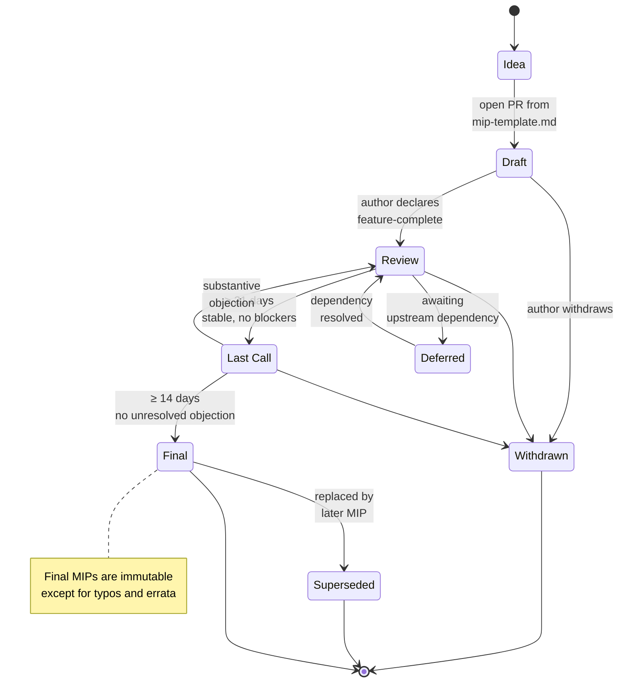

## Abstract

This MIP defines the Marque Improvement Proposal (MIP) process itself: the lifecycle of a MIP, the roles involved, the categories, and the criteria for each status transition.

MIP-0001 is **Active** rather than **Final**; it evolves in place as the process improves. Substantive changes to MIP-0001 follow its own procedure.

## Motivation

The Marque specification must evolve in a way that is:

1. **Auditable** — every normative change is traceable to a public discussion and a merged MIP.
2. **Principled** — governance follows [GOVERNANCE.md](../GOVERNANCE.md)'s principles, not ad-hoc editor preference.
3. **Inclusive** — any contributor can propose a change; no single organization can block a change they oppose without substantive argument.
4. **Finite** — MIPs reach a terminal state (Final, Withdrawn, or Superseded) within a bounded timeline; proposals do not hang in limbo.

The IETF RFC process, Ethereum's EIP process, and Rust's RFC process all inform this design.

## Specification

### 1. Roles

- **Author** — the natural person or team proposing the change. Authors drive the MIP; editors do not author substantive changes to others' MIPs without consent.
- **Editor** — a member of the editor team per [GOVERNANCE.md](../GOVERNANCE.md). Editors perform status transitions, merge PRs, and guard process integrity.
- **Reviewer** — anyone who reads and comments on a MIP. Reviewer comments have no formal weight but are required input.
- **Implementer** — an operator of a conformant Marque stack. Implementer feedback on a MIP is **heavily weighted** by editors.

### 2. Categories

| Category          | Scope                                                    | Implementation evidence required                                            |
| ----------------- | -------------------------------------------------------- | --------------------------------------------------------------------------- |
| **Core**          | Wire format, envelope, identity, legal-proof, transport. | One implementation by `Review`; two independent implementations by `Final`. |
| **Content**       | MBS block types, schema, registry rules.                 | One implementation by `Final`; conformance test vectors required.           |
| **Bridge**        | SMTP bridge, downgrade rules, legacy interop.            | One bridge implementation exercising the change by `Final`.                 |
| **Interface**     | Provider/client APIs affecting interop.                  | One implementation by `Final`.                                              |
| **Process**       | Governance, licensing, liaison, this process.            | Not applicable.                                                             |
| **Informational** | Rationale, best-practice notes.                          | Not applicable.                                                             |

### 3. Lifecycle

_Source: [`../docs/diagrams/mip-lifecycle.mmd`](../docs/diagrams/mip-lifecycle.mmd)._

#### 3.1 Idea

Open-ended discussion on GitHub Discussions, the announcement list, or a community call. No MIP number yet. Editors do not track Ideas; it is the author's responsibility to move to Draft when ready.

#### 3.2 Draft

- Author opens a PR adding `mips/mip-XXXX-short-title.md` from [`mip-template.md`](./mip-template.md).
- PR title: `MIP-XXXX: <short title>`. Label: `mip`.
- Two editor approvals merge the Draft. Merging requires only that the MIP is **well-formed**, not that it is correct.
- Subsequent revisions are PRs amending the MIP file.

**Draft** is cheap. Disagreement on substance does not block merging into Draft; it blocks advancing beyond it.

#### 3.3 Review

The author opens a PR transitioning status from `Draft` to `Review`, stating the MIP is feature-complete and ready for implementer scrutiny.

Editors advance to Review when (use this as your pre-Review self-check):

- [ ] All RFC 2119 language is precise.
- [ ] Backwards-compatibility, security, privacy, and legal-proof sections are filled in (or explicitly marked "no impact" with justification).
- [ ] At least one implementation sketch or branch exists (Core/Content/Bridge/Interface categories). No implementation in the Marque ecosystem is privileged; any conformance-passing codebase qualifies.
- [ ] No unresolved blocking comments remain from prior editor review.

Review is open-ended. The minimum duration is **21 days** to give implementers time to evaluate. There is no maximum, but editors SHOULD nudge MIPs stuck in Review for >180 days toward Withdrawn or Deferred.

#### 3.4 Last Call

Editors advance to Last Call when Review has produced a stable proposal with no outstanding substantive objections.

- Editors post a Last Call notice to the announcement list and `CHANGELOG.md`.
- **Minimum duration: 14 days.**
- Any Marque implementer or editor MAY raise a substantive objection that returns the MIP to Review. Objections MUST be technical or procedural; "I don't like it" returns to Review only if seconded by another implementer or editor.
- Editorial comments received during Last Call are incorporated by the author before Final.

#### 3.5 Final

- Editors merge the status change to `Final` and the spec updates that depend on the MIP.
- The MIP's section numbers, block definitions, or wire-format additions are incorporated into the relevant `spec/` files in the same PR or a companion PR.
- The `CHANGELOG.md` entry cites the MIP number.

**Final MIPs are immutable** except for typo fixes and errata (tracked in `docs/errata.md`).

#### 3.6 Withdrawn

An author MAY withdraw a MIP at any pre-Final status. Editors merge the status change. The MIP file is retained for historical reference.

#### 3.7 Superseded

When a later MIP supersedes an earlier Final MIP, editors update the earlier MIP's `superseded-by` field. The earlier MIP is retained; `Final` status persists but readers are directed to the successor.

#### 3.8 Deferred

Editors MAY defer a MIP if it depends on an unresolved upstream (e.g. a missing IANA codepoint, an IETF WG decision, a non-existent QTSP service). Deferred MIPs are revisited quarterly; the author or an editor may move them back to Review when the dependency resolves.

### 4. Review criteria

A MIP advances through its lifecycle based on **rough consensus**:

- No principled, articulated, unanswered technical objection.
- Majority of active reviewers in favor, with dissenting reviewers' concerns addressed in writing.
- At least one implementer commits to implementing before Final (Core/Content/Bridge/Interface categories).

**Rough consensus is not unanimity.** An editor MAY advance a MIP over a lone dissenter whose objection has been substantively answered and whose only remaining argument is disagreement about priorities or aesthetics. Editors MUST record such decisions with rationale in the PR thread.

### 5. Emergency procedure

For **security vulnerabilities** requiring urgent protocol change:

1. Editors convene an emergency call within 48 hours.
2. A short MIP is opened with accelerated timeline: Draft → Review (3 days) → Last Call (7 days) → Final.
3. The emergency justification is recorded in the MIP.
4. Emergency MIPs are retroactively reviewed by the full community within 30 days of Final; any editor may move to reopen.

Emergency procedure has been used zero times to date. It is a last resort.

### 6. Amending MIP-0001

Changes to MIP-0001 itself follow its own process plus:

- **30-day minimum Last Call** (double the default).
- **Editor supermajority (⅔)** required to advance from Last Call to Final.
- **No emergency procedure** applies to MIP-0001 itself.

## Rationale

**Why not use the IETF RFC process directly?** Marque will migrate to IETF process on charter. MIPs are the pre-charter lightweight equivalent; they translate directly into Internet-Draft sections.

**Why number MIPs sequentially by open-PR order rather than reserving numbers?** Number-reservation creates coordination overhead (fighting over MIP-42) and allows MIPs to squat on numbers without ever being opened. Sequential-by-PR is simpler and matches Ethereum's EIP practice.

**Why require 21 days Review and 14 days Last Call?** Most implementers do not check the repo daily. The windows are short enough to keep momentum and long enough that any implementer operating at human timescales can provide feedback.

**Why allow the editor team to override a lone dissenter?** Unanimity grants veto power to any single participant. That is not consensus; that is paralysis. The principled dissent path is "document your objection; if others agree, the MIP does not advance." If no one else agrees after public discussion, the objection has been answered.

## Backwards compatibility

Not applicable — this is the initial process MIP.

## Security considerations

The process itself is a trust-and-safety surface:

- **Author impersonation** — authors are verified by commit signing or DID-authenticated contribution where possible; unauthenticated PRs are accepted but reviewed with extra scrutiny.
- **Review-capture** — a coordinated campaign of sockpuppet reviewers could simulate consensus. Editors mitigate by weighting implementer feedback over drive-by review, and by requiring implementer sign-off for Core MIPs.
- **Emergency abuse** — the emergency procedure could be used to rush through a non-security change. Mitigated by retroactive 30-day review and editor supermajority for the emergency invocation itself.

## Privacy considerations

MIP authors may choose to use a `did:mail` or pseudonymous GitHub handle. Editors MUST NOT require legal identity for authorship.

## Copyright

CC-BY 4.0 per [LICENSE-SPEC](../LICENSE-SPEC).
